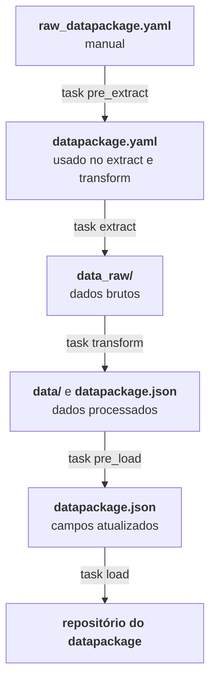

# Estrutura do repositório

Cada datapackage tem sua própria pasta em `datapackages/`:

```text
dados-orcamentarios/
├── .github/workflows/
│   └── etl.yaml                   # ETL diário
├── datapackages/
│   ├── fields.yaml                # metadado compartilhado dos campos
│   ├── dados_siafi/
│   │   ├── raw_datapackage.yaml   # descriptor "bruto", editável
│   │   ├── schemas/
│   │   │   ├── receita.yaml       # um schema por recurso
│   │   │   └── ...
│   │   ├── data_raw/              # dados brutos (extract)
│   │   └── data/                  # dados processados (transform)
│   └── ...
├── src/                           # scripts das tasks
└── pyproject.toml                 # tasks (taskipy)
```

## O fluxo do ETL

O processo todo é rodado pela `task etl`:



1. `pre_extract`: roda três tasks, para preparar o que o `extract` precisa:

    - [`workflow`](tasks/pre_extract/workflow.md): atualiza as opções de datapackage e ano do `etl.yaml`.

    - [`yaml`](tasks/pre_extract/yaml.md): gera o `datapackage.yaml` a partir do `raw_datapackage.yaml`.

    - [`bocache`](tasks/pre_extract/bocache.md): cria o cache do `bocli`.

2. [`extract`](tasks/extract.md): baixa os dados brutos para `data_raw/`.

3. [`transform`](tasks/transform.md): escreve os dados processados em `data/` e gera o `datapackage.json`.

4. [`pre_load`](tasks/pre_load.md): atualiza os campos do `datapackage.json`.

5. [`load`](tasks/load.md): publica `data/` e o `datapackage.json` no repositório do datapackage.

Todas as tasks estão listadas em [Tasks](tasks/tasks.md), e a execução diária no GitHub Actions em [Workflow](workflow.md).
